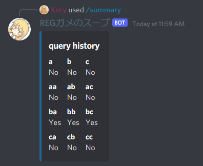

<!-- class: invert -->
<!-- theme: gaia -->

# **REGガメのスープ**

### by kory33 (@Kory__3)　　　　　 \- at VRC-LT #10

---

# ウミガメのスープ

 * 「水平思考ゲーム」とも呼ばれる

---

# ウミガメのスープ

 * 「水平思考ゲーム」とも呼ばれる
 * 「男がレストランでウミガメのスープを注文し、次の日自殺してしまった。何故？」といった質問を出題者が提示し、回答者は「Yes」、「No」、「分からない」で答えられる質問をして、真相を突き詰めていくゲーム

---

# ウミガメのスープ

 * 「水平思考ゲーム」とも呼ばれる
 * 「男がレストランでウミガメのスープを注文し、次の日自殺してしまった。何故？」といった質問を出題者が提示し、回答者は「Yes」、「No」、「分からない」で答えられる質問をして、真相を突き詰めていくゲーム

…らしいです　僕はやったことないのでよくわかりません

---

# 正規ウミガメのスープ

---

# 正規ウミガメのスープ

VRC-LT #10での発表内容何にしようかな～とTweetdeckを眺めながら考えていたらこれが流れてきた

---

# 正規ウミガメのスープ

VRC-LT #10での発表内容何にしようかな～とTweetdeckを眺めながら考えていたらこれが流れてきた

<blockquote class="twitter-tweet" data-lang="ja" data-dnt="true">
正規ウミガメのスープ: 出題者が正規表現をひとつ思い浮べて隠す。回答者が文字列を提出し、出題者はその文字列がマッチするかを YES / NO で答える、ということを繰り返す。できるだけ少ない質問回数で隠された正規表現を特定することを目指す
&mdash; kimiyuki@うさぎ🐇 (@kimiyuki_u) <a href="https://twitter.com/kimiyuki_u/status/1437322747692994565?ref_src=twsrc%5Etfw">2021年9月13日</a></blockquote> 

---

# 正規表現って何？

<blockquote>
<strong>正規表現</strong>（せいきひょうげん、英: regular expression）は、文字列の集合を一つの文字列で表現する方法の一つである。
&mdash; 正規表現 - ウィキペディア (Wikipedia): フリー百科事典</blockquote>

---

# 正規表現って何？

#### 例えば…

 * `εa|ab` は、 `"a"` と `"ab"` にのみマッチする。
 * `(a|b)*` は、 `"a"` と `"b"` のみ含む文字列なら何にでもマッチする。
 * `(a|ba)*` は、「`'b'`の後には必ず`'a'`がある文字列」なら何でもマッチする。 `'bb'` はマッチしない。
 * `bb*` は、「一回以上の`'b'`の繰り返しである文字列」なら何でもマッチする。 `'b'` や `'a'` にはマッチしない。

---

# 正規ウミガメのスープ(再掲)

<blockquote class="twitter-tweet" data-lang="ja" data-dnt="true">
正規ウミガメのスープ: 出題者が正規表現をひとつ思い浮べて隠す。回答者が文字列を提出し、出題者はその文字列がマッチするかを YES / NO で答える、ということを繰り返す。できるだけ少ない質問回数で隠された正規表現を特定することを目指す
&mdash; kimiyuki@うさぎ🐇 (@kimiyuki_u) <a href="https://twitter.com/kimiyuki_u/status/1437322747692994565?ref_src=twsrc%5Etfw">2021年9月13日</a></blockquote> 

 

というゲームです

---

# 実際にプレイしてみる

* いなむ先生([@mitama_rs](https://twitter.com/mitama_rs); 左画像)が出題者となり、僕を含む3名ほどが回答者としてプレイ
* 文字集合は $\Sigma = \{$'a', 'b', 'c'$\}$ に固定

---

# 実際にプレイしてみる

* いなむ先生([@mitama_rs](https://twitter.com/mitama_rs); 左画像)が出題者となり、僕を含む3名ほどが回答者としてプレイ
* 文字集合は $\Sigma = \{$'a', 'b', 'c'$\}$ に固定
* 答えは `(a|b|c)*(a|b)(a|b)(a|b)`。合計82回もの質問がなされ、バトルはなんと1時間にも及んだ

---

# プレイしてみた感想

  

* 出題者はマッチするかどうかを返答するのがめんどくさい
* 回答者は数十回にも及ぶやり取りを覚えられない
---

# プレイしてみた感想

* 出題者は回答が正しいかどうか判別するのが面倒
  - 例えば、出題 `(a|b|c)*(a|b)(a|b)(a|b)` に対して `((a|b|c)*c(a|b)(a|b)(a|b)(a|b)*)|((a|b)(a|b)(a|b)(a|b)*)`
    という回答がされた(これらは等価)

---

# プレイしてみた感想

* 出題者は回答が正しいかどうか判別するのが面倒
  - 例えば、出題 `(a|b|c)*(a|b)(a|b)(a|b)` に対して `((a|b|c)*c(a|b)(a|b)(a|b)(a|b)*)|((a|b)(a|b)(a|b)(a|b)*)`
    という回答がされた(これらは等価)
  - 一般的に難しいので、ツールを使うしかない
  - これは計算量的にも困難なことが知られており、
    $\mathbf{EXPSPACE}$-完全 と呼ばれる決定問題クラスに属するらしい
  - なんでなのかは詳しい人に聞いてください

---

# プレイしてみた感想

人間が出題すると出題側も回答側も双方疲れる…

---

# プレイしてみた感想

人間が出題すると出題側も回答側も双方疲れる…

# ⇓

そうだ！Discord botを作ろう！

---

# Botの名前を募ったら…

<blockquote class="twitter-tweet" data-dnt="true">
急募：「正規表現ウミガメのスープ」を遊べるDiscord botの名前
&mdash; ぱそこんわからんねこ (@Kory__3) <a href="https://twitter.com/Kory__3/status/1437667095253192710?ref_src=twsrc%5Etfw">September 14, 2021</a></blockquote> 

---

# Botの名前を募ったら…

<blockquote class="twitter-tweet" data-dnt="true">
急募：「正規表現ウミガメのスープ」を遊べるDiscord botの名前
&mdash; ぱそこんわからんねこ (@Kory__3) <a href="https://twitter.com/Kory__3/status/1437667095253192710?ref_src=twsrc%5Etfw">September 14, 2021</a></blockquote> 

<blockquote class="twitter-tweet" data-dnt="true">
REGガメのスープ
&mdash; 星にゃーん (@takoeight0821) <a href="https://twitter.com/takoeight0821/status/1437667561605238786?ref_src=twsrc%5Etfw">September 14, 2021</a></blockquote> 

---

# Botの名前を募ったら…

<blockquote class="twitter-tweet" data-dnt="true">
急募：「正規表現ウミガメのスープ」を遊べるDiscord botの名前
&mdash; ぱそこんわからんねこ (@Kory__3) <a href="https://twitter.com/Kory__3/status/1437667095253192710?ref_src=twsrc%5Etfw">September 14, 2021</a></blockquote> 

<blockquote class="twitter-tweet" data-dnt="true">
REGガメのスープ
&mdash; 星にゃーん (@takoeight0821) <a href="https://twitter.com/takoeight0821/status/1437667561605238786?ref_src=twsrc%5Etfw">September 14, 2021</a></blockquote> 

 

## 採用

---

# Bot作った

 * 2日と少し(14日夕方から16日夜)かけて、いなむ先生と共同作成

---

# Bot作った

 * 2日と少し(14日夕方から16日夜)かけて、いなむ先生と共同作成
   * 正規表現の構文木に対する操作やパーサ、正規表現の等価判定、出題する正規表現のランダム生成、などを担当しました
 * プログラミング言語はRust、Discord botフレームワークは`serenity`を使用

---

# Bot作った

 * 2日と少し(14日夕方から16日夜)かけて、いなむ先生と共同作成
   * 正規表現の構文木に対する操作やパーサ、正規表現の等価判定、出題する正規表現のランダム生成、などを担当しました
 * プログラミング言語はRust、Discord botフレームワークは`serenity`を使用

 

 * ソースコードはISCライセンスで公開されています(https://github.com/LoliGothick/regex-soup-bot)

---

# 遊んでみる(1)

`/query str` のようにマッチするかどうかを問い合わせることができる

---

# 遊んでみる(2)

履歴表示が可能

---

# 遊んでみる(3)

 * `/guess expr` で回答
 * クエリ数の表示
 * ちゃんと等価性判定をしてくれる
   - オリジナルの問題は `(ab*|c|a)*` だが、 `(ab*|c)*` を受理してくれている)

---

# 問題生成の難しさ

 - 例えば、一切繰り返し(`*`)を含まない正規表現である `(aabcbcb)` 等は特定が非常に困難
   - 回答者は `"aabcbcb"` という文字列をひねり出すまで延々に NO を付きつけられる事になる

---

# 問題生成の難しさ

 - 例えば、一切繰り返し(`*`)を含まない正規表現である `(aabcbcb)` 等は特定が非常に困難
   - 回答者は `"aabcbcb"` という文字列をひねり出すまで延々に NO を付きつけられる事になる
 - 例えば `a` は問題として単純すぎてつまらない

---

# 問題生成の難しさ

 - 例えば、一切繰り返し(`*`)を含まない正規表現である `(aabcbcb)` 等は特定が非常に困難
   - 回答者は `"aabcbcb"` という文字列をひねり出すまで延々に NO を付きつけられる事になる
 - 例えば `a` は問題として単純すぎてつまらない
 - このような「難しすぎる」あるいは「つまらない」問題をどう避けるかは難しい
   - そもそもどのような問題が「良問」なのかは議論の余地がある

---

# 問題生成の難しさ(2)

 - 今の実装では、「0~15文字の文字列を1000個ほどランダム生成し、正規表現がこれらにマッチする率が25%から80%の間である」というチェックを出題前に行っている

---

# 問題生成の難しさ(2)

 - 今の実装では、「0~15文字の文字列を1000個ほどランダム生成し、正規表現がこれらにマッチする率が25%から80%の間である」というチェックを出題前に行っている
   - Botはこの条件を満たす問題を見つけるまで、ランダムに問題を生成し続ける
   - 難易度を上げようと文字種を増やすと、このチェックにずっと引っかからずに長い時間待たされることになってしまう

---

# 問題生成の難しさ(3)

 - 問題のクオリティに関する何らかのチェックは必要(今の実装でも、ランダムに生成した問題よりだいぶ「面白い」問題が出題されている)

---

# 問題生成の難しさ(3)

 - 問題のクオリティに関する何らかのチェックは必要(今の実装でも、ランダムに生成した問題よりだいぶ「面白い」問題が出題されている)
 - 生成される問題のうち、チェックを通過する問題の比率を上げないと生成が間に合わない

---

# 問題生成の難しさ(3)

 - 問題のクオリティに関する何らかのチェックは必要(今の実装でも、ランダムに生成した問題よりだいぶ「面白い」問題が出題されている)
 - 生成される問題のうち、チェックを通過する問題の比率を上げないと生成が間に合わない
 - 問題の「良さ」についての定量化と、「良い」問題をどう効率的に生成するかの議論が求められる

---

# まとめ

 * 正規ウミガメのスープなるゲームがいきなり生えてきた
 * 正規ウミガメのスープを遊べるbotを(共同)開発し、REGガメのスープBotと名付けることにした
 * 自動で出題し、ユーザーの回答との等価性を照合するようにした
 * 「良問」の定義と効率的な生成は難しい
 * 今後の課題：問題の「良さ」の定式化、そして問題生成の高速化
